# Overview

A Universal File Manager. Made for workers with workflows.

# Development

Project is an internal tool used by Tronog. Feel free to use it and fork it.

It was "vibe" coded, but with engineering touch.

Desired state is described in PRDs in docs/prd. They are an aggregation that describes the final desired state of an application.

Whenever new functionality is needed, a new section is added in a PRD document. Then to apply changes, we run inside Claude Code:
```bash
claude

> re-read /home/user/src/tr-file/docs/prd/00x.md and execute `Section Y`
```

# tr-file — a quick tour

tr-file is a two-panel file manager that runs in the browser or as a desktop app. It looks like
VS Code and uses the keys of Midnight Commander. This tour covers the main features in about ten
minutes. Every key named here can be changed (*Settings › Keyboard Shortcuts*), and `F1` shows
them all.

> The screenshots use a small sample folder. A browser keeps some chords for its own tabs
> (`Ctrl`+`T`, `Ctrl`+`W`, `Ctrl`+`Tab`, …). In the desktop app every key reaches tr-file.

---

## 1. The window

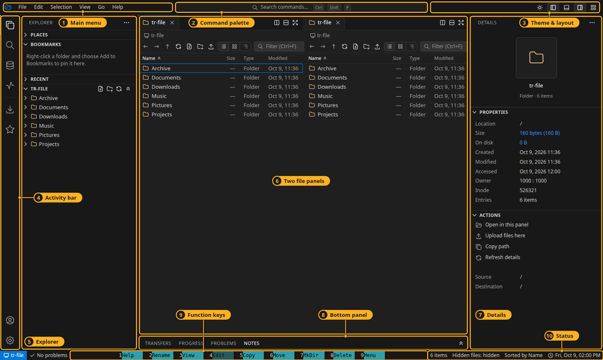

1. **Main menu** — File, Edit, Selection, View, Go, Help. `F9` opens it from the keyboard.
2. **Command palette** — every command, searchable (`Ctrl`+`Shift`+`P`).
3. **Theme and layout** — light/dark, show or hide the Explorer, Details and the bottom panel,
   and reset the layout.
4. **Activity bar** — switches between the *File Manager*, *Search*, *Disk Usage* and
   *Task Manager*. Below the line are Transfers and Bookmarks. At the bottom are your account
   and the settings gear.
5. **Explorer** — Places, Bookmarks, Recent folders and the folder tree. Clicking a folder shows
   it in the active panel.
6. **Two file panels** — side by side, as in Midnight Commander. The active panel is where your
   actions go. The other panel is where copies and moves go.
7. **Details** — everything about the entry under the cursor: a preview, its properties and
   actions. When the folder is in a Git repository, the Git pane is here too.
8. **Bottom panel** — Transfers, Progress, Problems and Notes. It starts collapsed.
9. **Function keys** — `F1`–`F10`, labelled with what they do right now. You can also click them.
10. **Status** — the item count and selection, hidden files, the sort order, and the server's
    clock.

`Ctrl`+`Tab` moves the keyboard round the parts: Explorer → each panel → bottom panel → Details.
`Ctrl`+`E`, `Ctrl`+`D` and `Ctrl`+`/` hide the sidebars when you need the room.

## 2. A panel

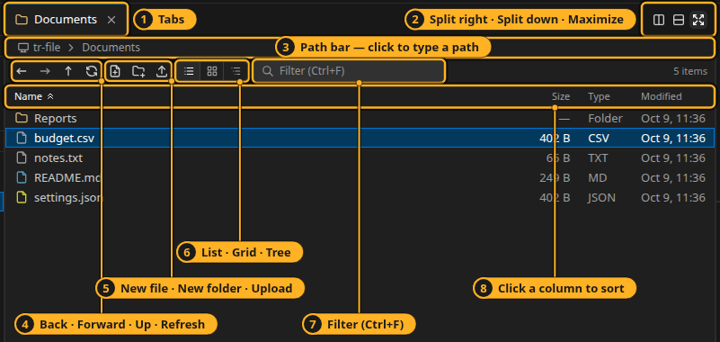

1. **Tabs** — a panel can hold many folders and files. `Ctrl`+`T` opens a new tab and
   `Ctrl`+`W` closes one.
2. **Split right, split down, maximize** — double-clicking a tab or pressing `Ctrl`+`↑` also
   maximizes.
3. **Path bar** — click a folder name to go there. Click the blank part (or press `Ctrl`+`L`) to
   type a path.
4. **Back, forward, up, refresh** — `Alt`+`←` / `Alt`+`→`, `Alt`+`↑` (or `Backspace`), and
   `Ctrl`+`R`. Each panel keeps its own history.
5. **New file, new folder, upload** — `F7` or `Ctrl`+`Shift`+`N` makes a folder.
6. **List, grid, tree** — the view (and the sort order) belongs to the *folder*, so a folder looks
   the same every time you come back.
7. **Filter** — `Ctrl`+`F` narrows the listing as you type.
8. **Sort** — click a column. Click it again to reverse the order. Folders always come first.

Moving around with the keyboard works as you would expect. The arrows, `Home`/`End` and the page
keys move the cursor, and typing letters jumps to a name. `Enter` opens a folder or file.

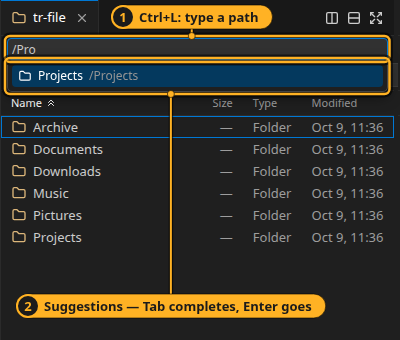

**The path bar suggests as you type** (1–2). `↓`/`↑` choose, `Tab` completes and `Enter` goes.
Typing a file's path opens its folder with the file selected.

## 3. Selecting, copying, moving

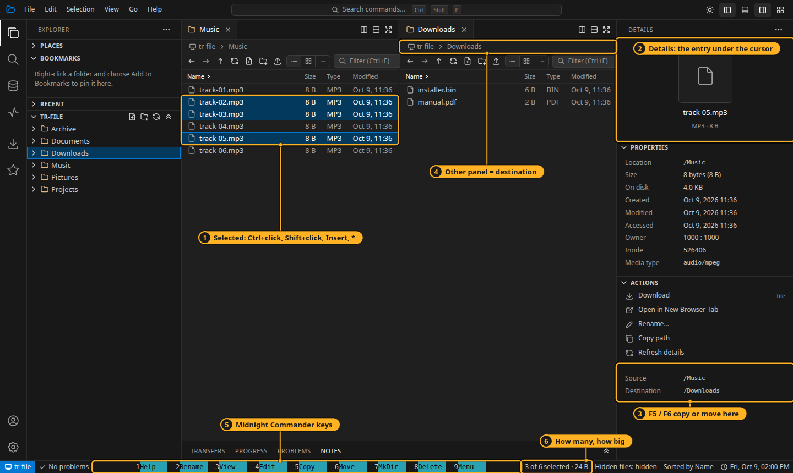

1. **Select several entries** with `Ctrl`+click and `Shift`+click, or with the keyboard:
   `Insert` marks an entry and moves down, `*` selects all or none, and `+` / `-` select or
   unselect by a pattern such as `*.mp3`.
2. **Details** describe the entry the cursor is on.
3. **Source and destination** are shown at the end of the Details sidebar, so you can see
   beforehand where `F5` / `F6` will go.
4. **The other panel is the destination.**
5. **The function keys** act on the selection: `F5` copy, `F6` move, `F8` delete permanently.
   `F2` renames and `F4` edits the entry under the cursor.
6. **The status bar** shows how many entries are selected and how big they are together.

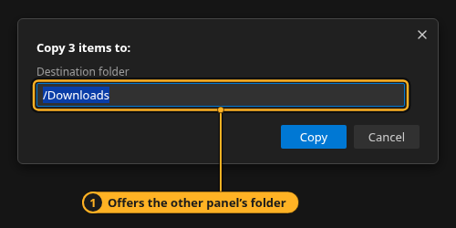

`F5` asks where to copy, and it offers the other panel's folder (1). Copies and moves run in the
background. A long one shows a progress window (*Run in Background* / *Cancel*) and a row in the
bottom panel's *Progress* tab. If an entry cannot be copied, tr-file asks the way Midnight
Commander does: *Skip*, *Skip All*, *Retry* or *Abort*.

Other ways to do the same:

- **Clipboard** — `Ctrl`+`C`, `Ctrl`+`X`, `Ctrl`+`V` between panels. Pasting a copy into the
  folder it came from makes `name copy.ext`.
- **Drag and drop** — drop onto a folder row or a panel's blank space. A drag moves; hold `Ctrl`
  to copy. Files dragged in from outside are uploaded.
- **Delete** — `Delete` moves entries to the trash, and always asks first. The trash is the last
  row of *Places*, where entries can be restored. `Shift`+`Delete` or `F8` deletes permanently.
- **Undo** — `Ctrl`+`Z` reverses the last change: a rename, a new file, a copy, a move or a
  move to the trash.

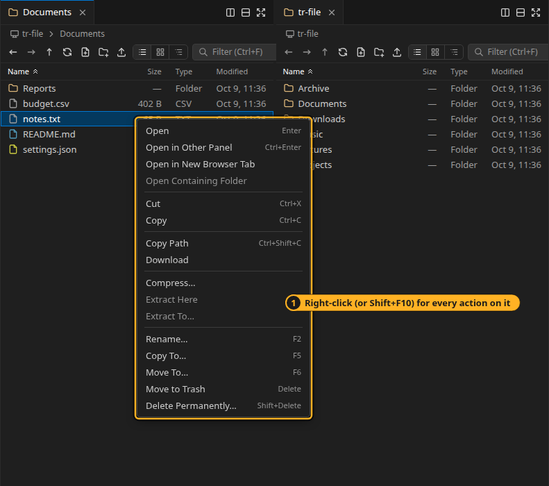

**Right-click** (or `Shift`+`F10`) shows every action for what you clicked on (1). That
includes *Copy Path* (`Ctrl`+`Shift`+`C`; press it twice for a UNIX-style path), *Compress…*
and *Open in Other Panel* (`Ctrl`+`Enter`). Blank space, tabs and tree folders have menus of
their own.

## 4. Panels, tabs and layout

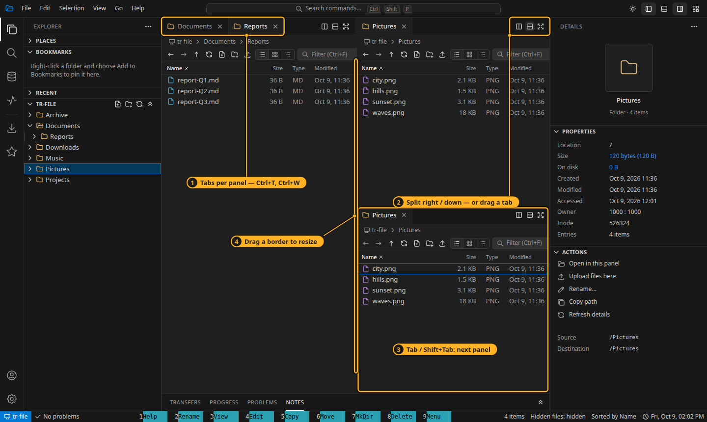

1. **Tabs per panel.** `Ctrl`+`PageUp` / `Ctrl`+`PageDown` switch between them, and a tab can be
   dragged to another panel. Each tab remembers its selection.
2. **Split** a panel right or down — `/` splits to the right.
3. **`Tab` / `Shift`+`Tab`** move between panels, as in Midnight Commander.
4. **Drag a border** to resize.

The layout — panels, tabs, folders, views and sizes — is restored when you come back. The gear
menu has *Reset Layout*.

## 5. Pictures

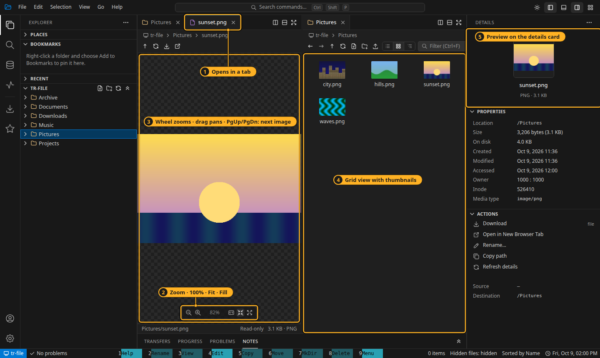

1. **Double-click a file** to open it read-only in a new tab. `Escape` closes the tab and takes
   you back to the listing.
2. **Zoom controls**: zoom out, zoom in, 100 %, fit, fill. The keys are `+`, `-`, `1` and `0`.
3. **The mouse wheel zooms** around the pointer, dragging pans, and a double click fits again.
   `PgUp` / `PgDn` go to the previous or next picture in the folder, and the listing follows.
4. **Grid view** shows thumbnails.
5. **The details card** previews the selected picture too.

## 6. Reading and editing files

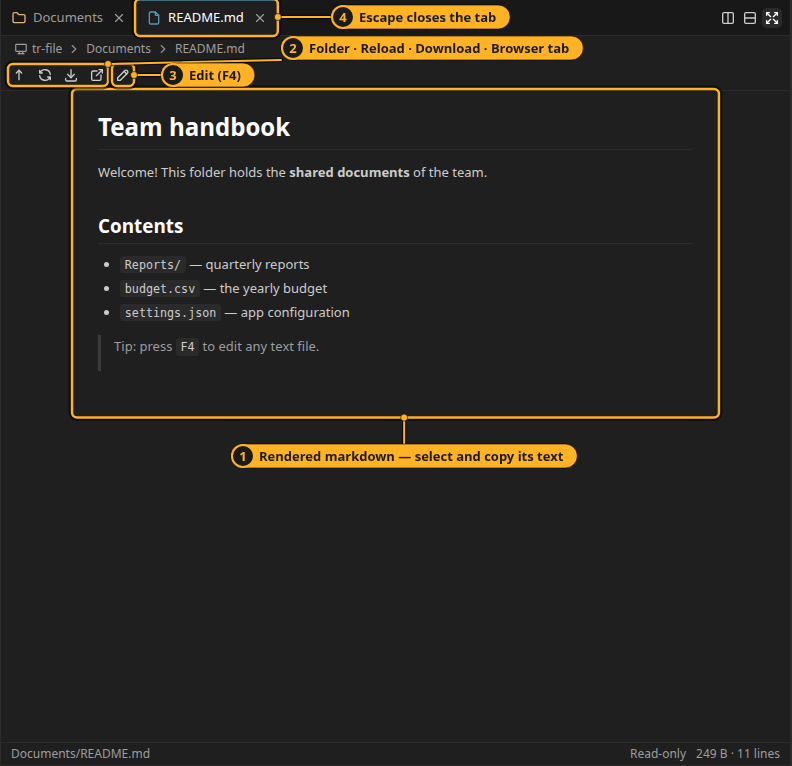

Text files open in a viewer. Markdown is rendered (1), and you can select and copy its text. The
toolbar (2) goes to the file's folder, reloads it, downloads it, or opens it in a browser tab.
Files the app cannot show (PDF, Office documents, …) open in the system's app, or in a browser tab.

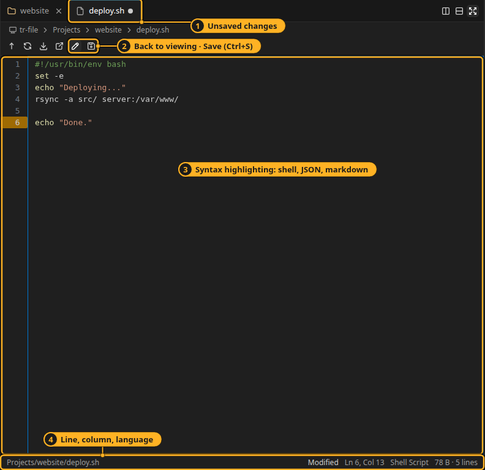

**`F4` — or the pencil — edits** the file in place:

1. A dot on the tab means there are unsaved changes. Closing the tab, or the window, asks first.
2. The pencil goes back to viewing. `Ctrl`+`S` saves. If the file changed on disk in the
   meantime, tr-file asks whether to overwrite it or take the disk's version.
3. Markdown, shell scripts and JSON are highlighted. `Ctrl`+`F` finds in the file, and `Tab`
   indents.
4. The status line shows the line, column and language.

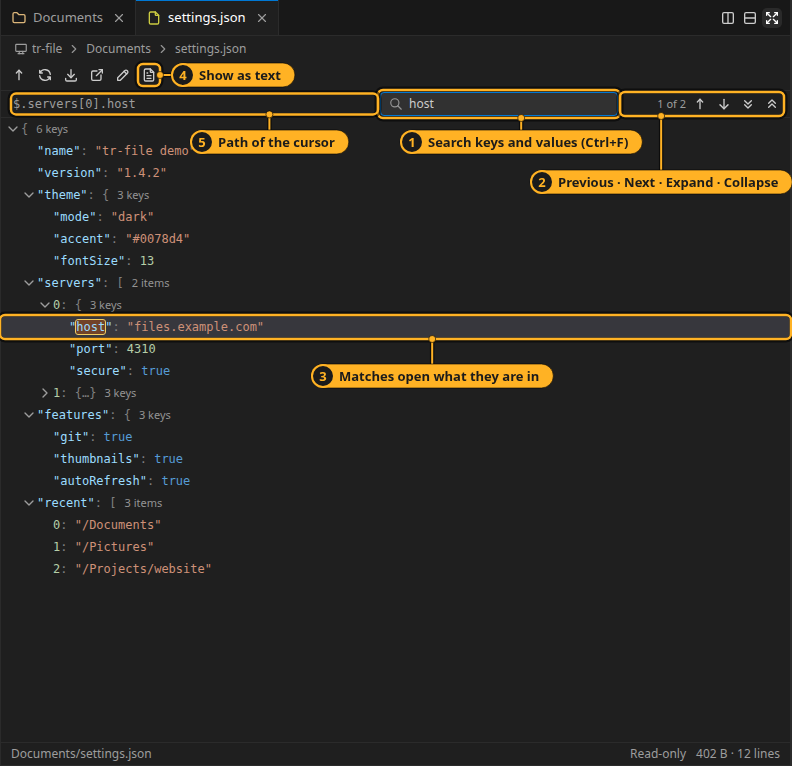

**JSON opens as a tree.**

1. Search keys and values (`Ctrl`+`F`).
2. `Enter` / `Shift`+`Enter` or `F3` step through the matches. You can expand or collapse
   everything.
3. Each match opens the objects it is inside.
4. Switch to the plain text.
5. The path of the value under the cursor (`$.servers[0].host`).

Double-click a key or a value (or press `F2`) to change it in place. The file keeps its own
layout and is saved with `Ctrl`+`S`. *Format Document* lays out the whole file again.

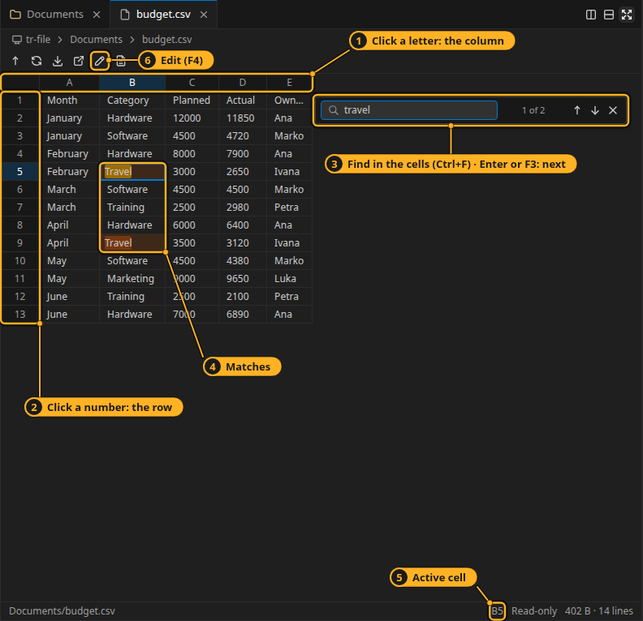

**CSV and TSV files open as a spreadsheet**, with Excel's keys:

1. Click a column letter to select the column.
2. Click a row number to select the row. Drag across cells to select a range. `Ctrl`+`C` copies
   tab-separated text that pastes straight into a spreadsheet.
3. Find (`Ctrl`+`F`). `Enter` or `F3` goes to the next match.
4. Matches are marked.
5. The active cell, or the range.
6. `F4` makes the sheet editable: type into a cell, use `F2`, `Delete`, paste and undo.
   *Show as Text* switches to the raw file.

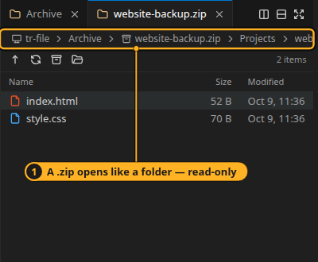

**A `.zip` opens like a folder** (1), read-only. *Extract Here*, *Extract To…* and *Compress…*
are in the context menu. A folder or a selection downloads as one zip.

## 7. Finding things

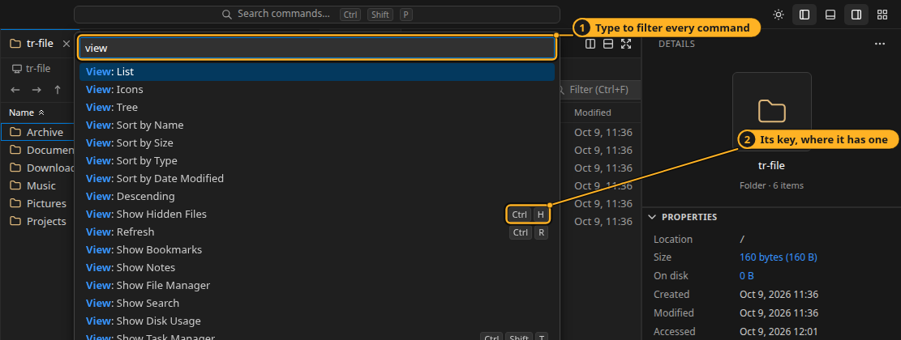

**The command palette** (`Ctrl`+`Shift`+`P`, or click the box in the title bar) lists every command.
Typing filters them (1), and each one shows its key (2). Some commands ask for a value right in
the box — *Go: Jump to Folder…* takes a path.

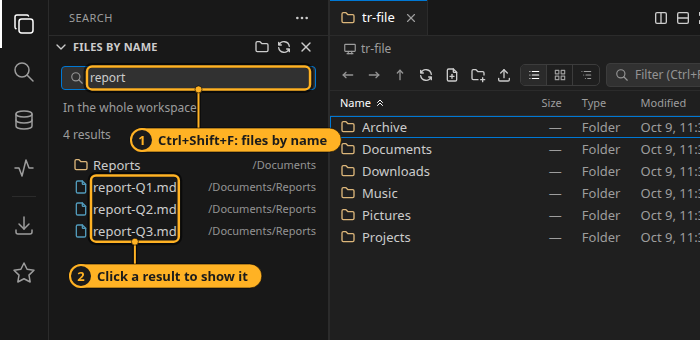

**Search** (`Ctrl`+`Shift`+`F`) finds files by name under the whole workspace or the active
folder (1). Click a result to show it in the active panel (2).

**Bookmarks**: right-click a folder and choose *Add to Bookmarks*. Drag bookmarks to put them
in order. On the desktop, `Ctrl`+`1` … `Ctrl`+`9` open the first nine.

## 8. Git

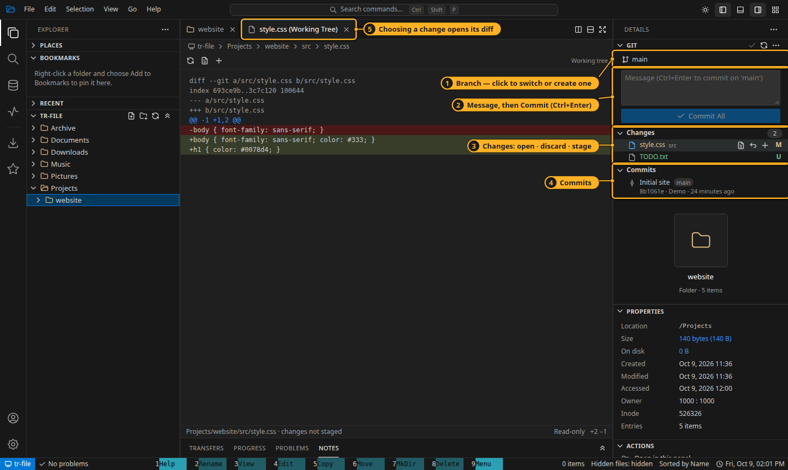

When the folder shown is in a Git repository, the Git pane appears at the top of Details:

1. The branch. Click it to switch to another branch or create one.
2. A commit message, then *Commit* (`Ctrl`+`Enter`). If nothing is staged, tr-file offers to
   stage everything.
3. Changes: open, discard (asks first) or stage each file — or all of them.
4. Recent commits.
5. Clicking a change opens its diff in a tab.

The pane's `…` menu has pull, push, sync, fetch, stash and pop. A commit made in a terminal shows
up by itself.

## 9. Disk Usage

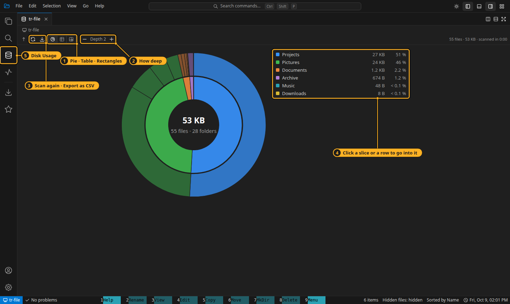

The activity bar's *Disk Usage* (5) shows where the space went. You can also press a folder's
*Size* in Details.

1. Pie, table or rectangles (a treemap).
2. How many levels deep to show (1–8).
3. Scan again, or export what is shown as a CSV file for Excel.
4. Click a slice or a row to go into it, and use the path bar to come back up. `Escape` stops a
   scan that is still running, and keeps what it found so far.

## 10. Task Manager

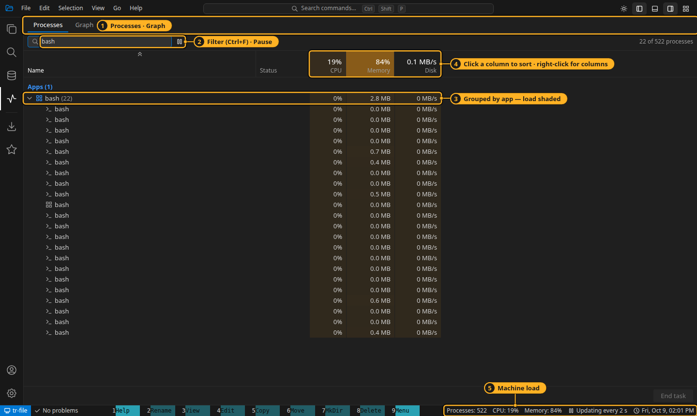

The *Task Manager* is like Windows' own, for the machine tr-file runs on (`Ctrl`+`Shift`+`T` on
the desktop):

1. *Processes* and *Graph* tabs.
2. Filter (`Ctrl`+`F`) and pause the updates.
3. Processes grouped by app, shaded by how much they use.
4. Click a column to sort. Right-click the header to choose columns.
5. The machine's load is in the status bar.

`Delete` ends a task and `Shift`+`Delete` ends the whole process tree — both ask first. The
right-click menu also has *Open File Location* and *Copy Details*.

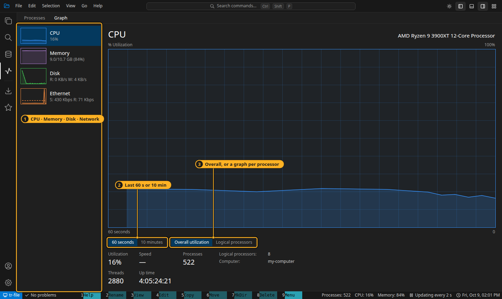

**Graph** shows CPU, memory, disk and each network adapter (1), over the last 60 seconds or
10 minutes (2). CPU can be one graph, or one per logical processor (3).

## 11. The bottom panel and Notes

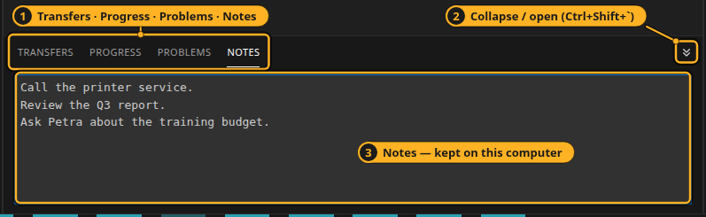

1. **Transfers** (uploads and downloads), **Progress** (file jobs), **Problems** and **Notes**.
   The counts on the tabs tell you when something happened.
2. Collapse or open the panel (`Ctrl`+`Shift`+`` ` ``). Choosing a tab also opens it.
3. **Notes** is one plain text, saved as you type and kept on this computer.

## 12. Settings, themes and help

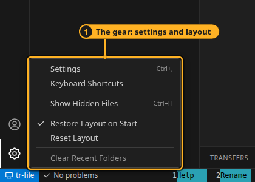

The **gear** at the bottom of the activity bar (1) has Settings, Keyboard Shortcuts, hidden
files (`Ctrl`+`H`) and the layout options.

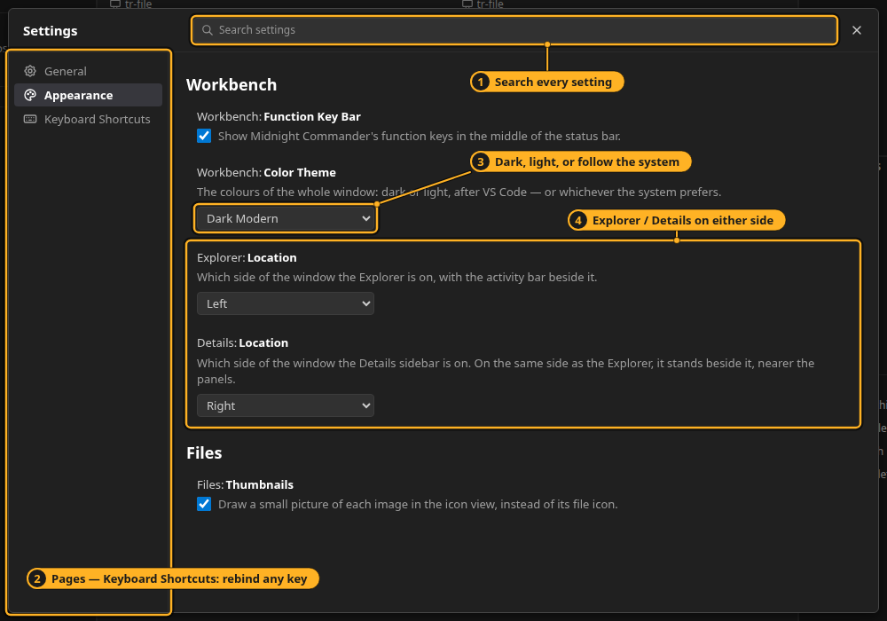

**Settings** (`Ctrl`+`,`):

1. Search every setting.
2. The pages: *General*, *Appearance*, and *Keyboard Shortcuts*, where any key can be changed,
   added or removed.
3. Color theme: dark, light, or follow the system.
4. Put the Explorer and Details on either side of the window.

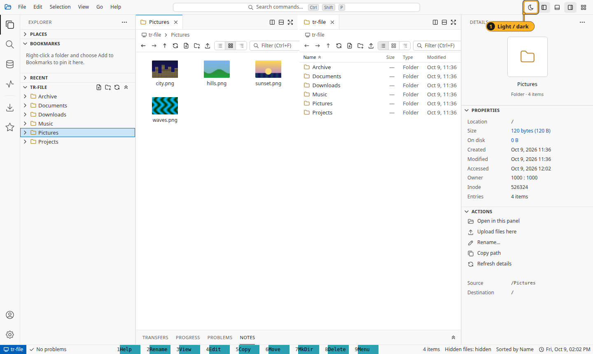

**Light or dark** — the title bar's sun / moon button (1) switches between them.

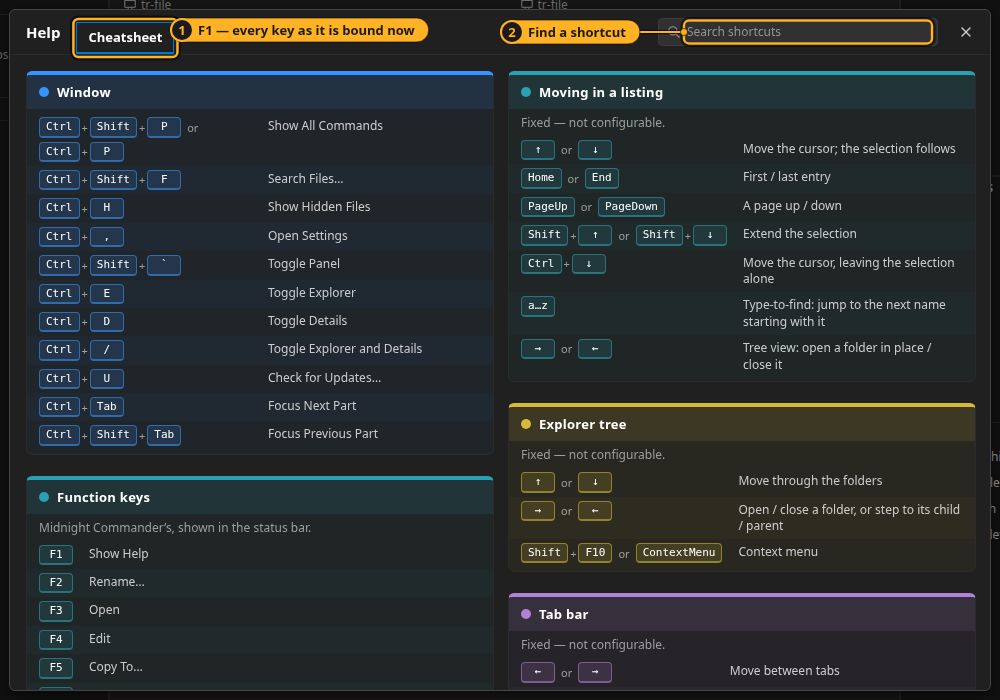

**`F1` opens the cheatsheet** (1). It lists every key as it is bound right now, including your
own changes, and you can search it (2). The full list is also in [SHORTCUTS.md](../../SHORTCUTS.md).

## 13. In the desktop app

The desktop app (Windows, Linux, macOS) runs the whole thing in one window, with a few extras:

- **The whole computer**: every drive on Windows, and `/` elsewhere. A new window opens in your
  home folder.
- **Remote servers**: *Go › Remote Computer…* connects the window to another tr-file server.
  Saved servers are kept without their passwords.
- **System integration**: it uses the system clipboard and the system trash, lets you drag files
  out to other apps, and has *Open with the default app* and *Reveal in folder*.
- **Window zoom**: `Ctrl`+`=` / `Ctrl`+`-` / `Ctrl`+`0`, also from the title bar.
- **Show and hide the window** from any application: `Ctrl`+`` ` ``.
- **Updates**: *File › Check for Updates…* (`Ctrl`+`U`). When a new version is ready, a blue
  *Upgrade* button appears in the title bar.
